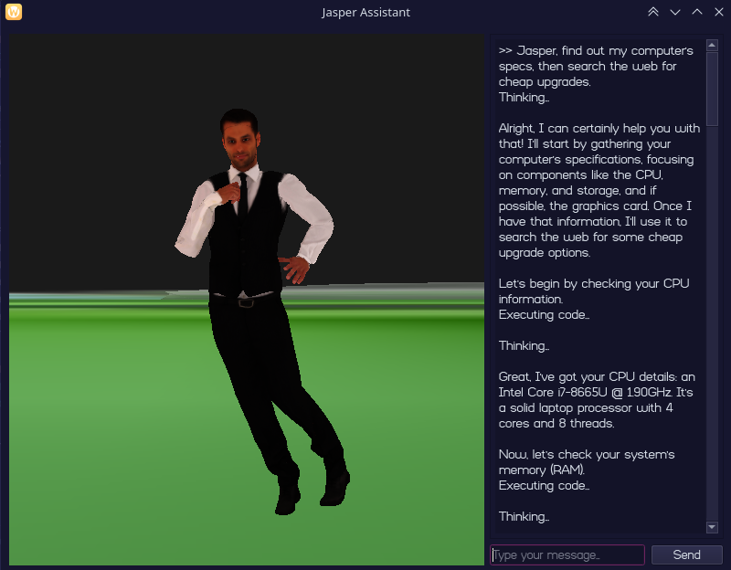

# jasper
Jasper Assistant. Ready to help you do whatever you need, on your computer.



*Jasper in action*

## How to use

1. Clone the repo

```sh
git clone https://github.com/uukelele-scratch/jasper.git && cd jasper
```

2. Install Requirements

```sh
pip install -r requirements.txt
```

3. Create a `.env` file

```sh
echo "GEMINI_API_KEY=your_api_key_here" > src/.env
```

4. Start the CLI

```sh
cd src && python cli.py
```

5. Start the 3D GUI Interface

```sh
cd src && python main.py
```

## How to use your own models

1. Find a model:
- https://sketchfab.com/search?category=people&features=downloadable&q=person+rigged&type=models

2. Download the model as FBX.

3. Create an account at Mixamo:
- https://www.mixamo.com

4. Upload your model using the "UPLOAD CHARACTER" button.

5. Search for any animations you want.
- We used the Locomotion pack, as well as some searching, thinking, and rummaging animations.

6. Download them with the following settings: (if available)
- **Format:** FBX 7.4(.fbx)
- **Skin:** Without Skin
- If your download is a .zip file instead of .fbx, extract the zip to find FBX files inside.

7. Place all the fbx animation files you have downloaded into `src/models/fbx_animations`.

8. Download and install Blender.
- Keep note of the installation path (default is `/usr/bin/blender`)
- Put this into your `.env`: `echo "BLENDER_PATH=/path/to/blender" >> src/.env && source .env`

9. Run the conversion script:

```sh
cd src/models && chmod +x convert-all.sh && ./convert-all.sh
```

10. Give the code the correct files:

Open `src/main.py` in your preferred text editor.

Find this:

```python
animations_to_load = {
    "idle":                "models/animations/idle.glb",
    "jump":                "models/animations/jump.glb",
    ...
}
```

Replace or add to it your own models and their paths, as well as names for Jasper to reference while controlling the body.
**REQUIRED** animation names are:

- `idle`
- `thinking`
- `executing`
- `searching`

You can leave these as default, or replace them with your own if desired.